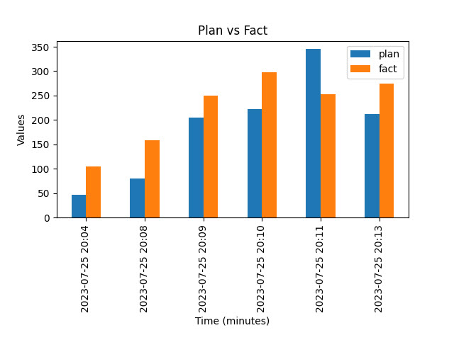

# Тестовое задание от Root Code

<a href = "https://github.com/A-Kuklin/root_code_cv/blob/main/task_description.md">Само задание</a> 
<a href = "https://github.com/A-Kuklin/root_code_cv/blob/main/.env.example">Пример `.env` файла</a> 

Расположение сущностей из задания: 
• Веб-приложение — <a href = "https://github.com/A-Kuklin/root_code_cv/blob/main/app/">папка `app`</a> 
• Фоновая задача 1 — <a href = "https://github.com/A-Kuklin/root_code_cv/blob/main/server/">папка `server`</a> 
• Скрипт 1 — <a href = "https://github.com/A-Kuklin/root_code_cv/blob/main/server/">папка `server`</a> 

## Запуск с помощью Docker
В случае, если тестовая база данных расположена на локальном компьютере, с которого осуществляется запуск, то
хост базы данных необходимо прописать как `host.docker.internal`

В папке с файлом `docker-compose.yml` выполнить команды: 

    docker-compose build
    docker-compose up

## Локальный запуск
 - запустить приложение `app.py`, 
 - следом сервер обработки сообщений `server.py`, 
 - после скрипт, который отправляет тестовые данные в базу данных `script.py`.

## APP
Код приложения FastAPI, один endpoint GET `/chart`, по которому отправляется график. 
Из задания 

    … приложение возвращает … столбчатая диаграмма, в которой … (по оси Х - время в минутах).
    График должен формироваться … с поминутной группировкой.

График строится поминутно в формате `1970-01-01 03:00`. 
Формат отображения минут можно поменять в `.env` файле.  
Хост / порт указываются в `.env` файле.  

## CLIENT
Скрипт, который раз в 10 секунд отправляет рандомные значения план / факт в виде `json`.

## SERVER
Задача, которая принимает значения от скрипта, описанного выше, и сохраняет данные в базу данных.
   

## СПРАВОЧНО
 - Из задания

        при старте бэка … нужно стартовать 1 фоновую задачу и 1 скрипт С.
        Веб-приложение вместе со скриптом 1 должны быть упакованы в докер-контейнер,
        скрипт С стартует вместе с бэком при запуске контейнера.

    Мог неправильно понять как должны быть скомпонованы веб-приложение / фоновая задача / скрипт, 
    поэтому разделил задачи на отдельные сервисы.  
 - Стоит обратить внимание на значения локального хоста при необходимости. 
    Например, для запуска в докере стоит указать `0.0.0.0`, при значениях `localhost` / `127.0.0.1` могут возникнуть проблемы.  
 - Пример изображения  

